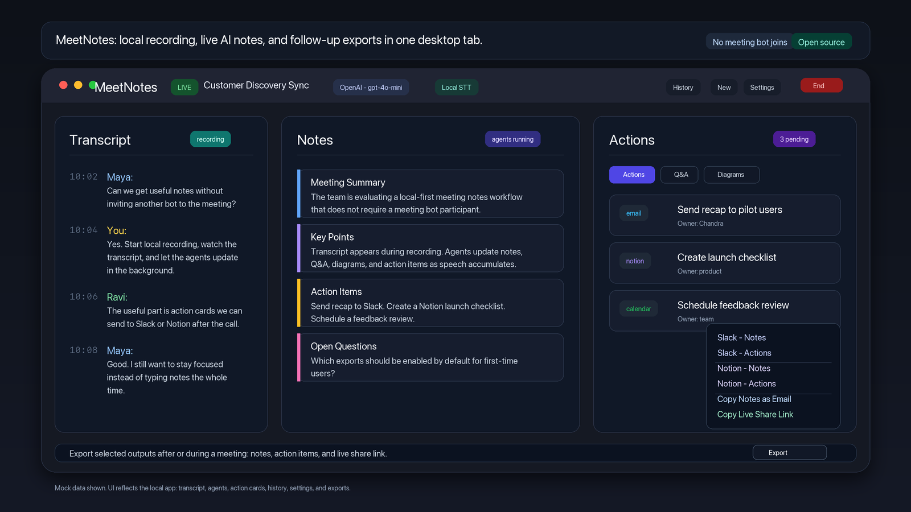

# MeetNotes

**Local-first AI meeting assistant.** Captures mic audio locally, transcribes with Whisper on CPU, and dispatches Claude or OpenAI agents that produce live notes, action items, Q&A answers, and sketches — all served in a browser tab at `http://localhost:8000`.

[](https://python.org)
[](#license)



---

## Features

- **Real-time transcription** — `faster-whisper` runs on your CPU; no cloud speech-to-text service or STT API key needed
- **Parallel AI agents** — every ~3 speech chunks, five built-in agents fire simultaneously through either Claude CLI or OpenAI:
  - **Transcriber** — clean, timestamped, filler-word-free transcript
  - **Note-taker** — structured notes (summary, key points, decisions, open questions)
  - **Action extractor** — JSON action items tagged as `email`, `calendar`, `notion`, or `research`
  - **Q&A agent** — every question raised in the meeting, answered in real time
  - **Sketch artist** — live mindmap-style outline plus optional Mermaid diagrams when the discussion has a real workflow or system to draw
- **Custom agents** — add up to 8 user-defined agents (sales coach, risk analyst, tech reviewer, etc.) via the `+ Agent` button in the UI
- **Live browser UI** — single-page app with SSE push every 0.5 s; Markdown via marked.js, diagrams via mermaid.js
- **Action routing** — one click drafts a Gmail message (mailto), creates a Google Calendar event, pushes a Notion task, or runs an inline research brief
- **Follow-up exports** — export notes and action items to Slack or Notion, copy notes for email, or copy a live share link
- **Auto-dispatch** — agents re-run automatically on accumulated speech; manual trigger with Enter or the UI button
- **Auto-stop** — configurable silence timeout and hard session ceiling
- **No database** — all output written as flat files to `~/Desktop/meeting-output/`
- **Privacy model** — audio capture and Whisper transcription are local; transcript text is sent to your configured AI provider for agent generation; output files stay on your machine

---

## Architecture

```
Microphone (sounddevice, 16 kHz mono)
  │
  ▼  VAD + silence detection (RMS threshold)
Audio buffer (~0.6 s min speech, ~1.6 s silence flush, 8 s max)
  │
  ▼
faster-whisper (CPU, int8, beam_size=3, VAD filter)
  │  writes transcription.md immediately → UI sees it within ~0.5 s
  ▼  every 3 new chunks (min 60 s between runs)
Dispatcher  ──────── ThreadPoolExecutor (Claude/OpenAI agents in parallel)
  ├── transcriber      →  output/transcription.md
  ├── note-taker       →  output/meeting-notes.md
  ├── action-extractor →  output/actions.json
  ├── interview-agent  →  output/interview-answers.md
  ├── sketch-artist    →  output/sketch.md
  └── custom-<id>      →  output/custom-<id>.md  (0–8 agents)
            │
            ▼  file writes polled every 0.5 s
      FastAPI + SSE  ──────▶  Browser UI  (http://localhost:8000)
                    ◀──REST── Action routing (email / calendar / notion / slack)
```

Each agent receives the full accumulated transcript plus the current contents of its own output file so it can refine and append incrementally. Set `AI_PROVIDER=claude` to use the Claude Code CLI, or `AI_PROVIDER=openai` to use the OpenAI Responses API via the Python SDK.

---

## Requirements

| Requirement | Notes |
|---|---|
| Python 3.10+ | `python3 --version` to check |
| OpenAI API key with API credits/billing, or [Claude Code CLI](https://claude.ai/code) login | OpenAI is the default; use `AI_PROVIDER=claude` if you prefer Claude CLI |
| A microphone | Any system mic works; 16 kHz mono capture |
| macOS or Linux | Windows works but `sounddevice` setup may vary |
| **Optional** | |
| `NOTION_TOKEN` + `NOTION_DATABASE_ID` | Push action items and pages to Notion |
| `SLACK_WEBHOOK_URL` | Export notes and action items to a Slack channel |
| Google OAuth credentials | Create Google Calendar events from action items |

---

## Quick Start

```bash
# 1. Clone
git clone https://github.com/Kmaralla/meeting-minutes.git
cd meeting-minutes

# 2. Create and activate a virtual environment
python3 -m venv meetingenv
source meetingenv/bin/activate        # Windows: meetingenv\Scripts\activate

# 3. Install dependencies
pip install -r requirements.txt

# 4. Configure OpenAI (default provider)
cp .env.example .env
# Edit .env and set OPENAI_API_KEY, or paste the key in Settings after the UI opens.
# Your OpenAI API project needs API billing/credits; ChatGPT Plus/Pro is separate.

# Optional: use Claude CLI instead
# Set AI_PROVIDER=claude in .env, then run `claude` once to log in.

# 5. Start recorder + UI together
./run.sh --both

# 6. Open the UI
open http://localhost:8000            # or navigate there manually
```

The first run downloads the Whisper `base` model (~74 MB), which takes about 30 seconds.

Press **Enter** in the terminal at any time to manually trigger all agents. Press **Ctrl+C** to stop — a final dispatch runs automatically before exit.

---

## Configuration

Configuration is read from your shell environment and `.env`. The in-app Settings dialog writes provider, model, and OpenAI key values back to `.env`; Slack webhook values are stored in the browser for exports and may also be supplied through `.env`. The AI dependency is provider-specific: Claude uses the Claude Code CLI/auth, while OpenAI uses `OPENAI_API_KEY`.

| Variable | Required | Default | Description |
|---|---|---|---|
| `AI_PROVIDER` | No | `openai` | AI backend for all agent, email, and research workflows: `claude` or `openai` |
| `ANTHROPIC_API_KEY` | No | — | Optional Claude Code CLI auth; most local setups use `claude /login` instead |
| `OPENAI_API_KEY` | Provider-specific | — | Required when `AI_PROVIDER=openai` |
| `OPENAI_MODEL` | No | `gpt-4o-mini` | OpenAI model used for agent, email, and research workflows |
| `SLACK_WEBHOOK_URL` | No | `""` | Incoming webhook URL from `api.slack.com/apps` -> Incoming Webhooks. You can also paste it in Settings for browser-local use. |
| `NOTION_TOKEN` | No | `""` | Notion integration secret from `notion.so/my-integrations` |
| `NOTION_DATABASE_ID` | No | `""` | ID of the target Notion database (32-char hex in the page URL) |
| `GOOGLE_CREDENTIALS_FILE` | No | `~/.config/google/meeting-credentials.json` | OAuth 2.0 credentials JSON from Google Cloud Console |
| `GOOGLE_TOKEN_FILE` | No | `~/.config/google/meeting-token.json` | Where the OAuth token is cached after first authorization |
| `GOOGLE_CALENDAR_TZ` | No | `America/New_York` | IANA timezone for calendar event creation |

Output files are always written to `~/Desktop/meeting-output/`. Custom agent definitions are stored at `~/.config/meetingnotes/custom_agents.json`.

### AI provider selection

OpenAI is the default provider for the public setup path:

```bash
AI_PROVIDER=openai OPENAI_API_KEY=sk-... ./run.sh --both
```

To run every agent and workflow through Claude CLI instead:

```bash
export AI_PROVIDER=claude
claude  # run once if you need to log in
./run.sh --both
```

The provider switch applies to built-in agents, custom agents, email drafting, and inline research briefs. Whisper transcription still runs locally on CPU in both modes. Provider changes made in Settings are safest for the next recording; restart an active recording before relying on a provider change. The top-bar AI status message and affected panes surface missing keys, quota/rate-limit errors, and per-agent failures so you are not hunting through terminal logs first.

---

## Usage

### Starting and stopping

```bash
./run.sh --both          # recorder + UI (recommended)
./run.sh                 # recorder only
./run.sh --server        # UI only (auto-restarts on crash)
./run.sh --stop          # stop the running recorder session
./run.sh --status        # check whether a session is active
./run.sh --dispatch-only # re-run all agents on saved transcript, no mic
```

You can also start and stop recording from the **Start / Stop** button in the UI. Click the meeting title in the top bar to name the current session before or during recording. When you end or clear a session, the save dialog reuses that title; if you leave it blank, MeetNotes tries to infer a concise title from the final notes before saving to History.

### End-to-end smoke test

1. Run `./run.sh --both` and open `http://localhost:8000`.
2. Start recording from the UI, then speak for 30-90 seconds until transcript chunks appear.
3. Agents auto-run after enough transcript chunks accumulate, with a minimum interval of about 60 seconds. You can also press **Enter** in the terminal or use the UI dispatch button to force a run.
4. Notes, Actions, Q&A, and Sketch update as agent outputs arrive. If an AI provider fails, the affected pane shows the provider error directly.
5. End the meeting from the UI. The session is saved to History, the recorder runs a final dispatch as it exits, and output files remain in `~/Desktop/meeting-output/`.

### Whisper model selection

Pass `--model` to tune the accuracy/speed tradeoff. The flag is forwarded directly to `meetingnotes.py`:

```bash
./run.sh --both --model small    # better with accents or technical vocabulary
./run.sh --both --model medium   # near human-level accuracy, slower on CPU
```

| Model | Size | Notes |
|---|---|---|
| `tiny` | 39 MB | Fastest; good for quick tests |
| `base` | 74 MB | **Default** — good balance for most meetings |
| `small` | 244 MB | Better with accents and technical terms |
| `medium` | 769 MB | Maximum accuracy; noticeably slower on CPU |

### UI tabs

| Tab | Content |
|---|---|
| **Transcript** | Live timestamped transcript updated after each Whisper chunk |
| **Notes** | Structured meeting notes: summary, key points, decisions, action items, open questions |
| **Actions** | Extracted action items with type badge; click any item to draft or route it |
| **Q&A** | Every question raised in the meeting with an AI-generated answer |
| **Sketch** | Mindmap-style outline rendered live, with optional Mermaid diagrams when the transcript includes a workflow or system |
| **Custom agents** | One live-updating tab per custom agent you have added |

### Exporting content

The bottom **Export** menu currently supports **Slack - Notes**, **Slack - Actions**, **Notion - Notes**, **Notion - Actions**, **Copy Notes as Email**, and **Copy Live Share Link**. Action cards can also be routed individually:

| Action type | What happens |
|---|---|
| `email` | Opens a pre-filled `mailto:` draft |
| `calendar` | Creates a Google Calendar event |
| `notion` | Creates a Notion database entry |
| `research` | Runs an inline AI research brief through the configured provider (4–6 bullet points) |

---

## Custom Agents

Click **+ Agent** in the tab bar to add a custom agent. Provide a name and a system prompt describing the agent's role and output format.

The agent receives the full accumulated transcript and the current contents of its own output file on every dispatch — the same contract as the built-in agents. Up to 8 custom agents are supported.

**Template ideas:**

- *Sales coach* — identify objections, buying signals, and suggested follow-up questions
- *Risk analyst* — flag commitments, blockers, and open dependencies with severity ratings
- *Tech reviewer* — surface architectural decisions and technical debt mentioned in passing
- *Legal / compliance* — highlight regulatory terms or commitments requiring review

Custom agent definitions persist in `~/.config/meetingnotes/custom_agents.json` across sessions and are picked up automatically on every dispatch without restarting.

---

## Integrations

### Slack

1. Go to `api.slack.com/apps` → **Create App** → **From Scratch**.
2. Enable **Incoming Webhooks** → **Add New Webhook to Workspace** → select a channel.
3. Copy the webhook URL and set `SLACK_WEBHOOK_URL=https://hooks.slack.com/services/...`.

Use the bottom **Export** menu to send notes or action items to Slack. Ending a meeting saves/finalizes the session; it does not auto-send Slack messages.

### Notion

1. Go to `notion.so/my-integrations` → **New integration** → copy the secret as `NOTION_TOKEN`.
2. Open the target database page → **Share** → invite your integration.
3. Copy the database ID from the page URL (the 32-char hex segment) as `NOTION_DATABASE_ID`.

`notion` action items create database entries. The bottom **Export** menu can also send Notes or Actions as Notion pages.

### Google Calendar

1. Go to [console.cloud.google.com](https://console.cloud.google.com) → create a project → enable **Google Calendar API**.
2. **Credentials** → **Create Credentials** → **OAuth 2.0 Client ID** → **Desktop app** → download the JSON file.
3. Save it to `~/.config/google/meeting-credentials.json` (or set `GOOGLE_CREDENTIALS_FILE`).
4. On first use, a browser window opens for OAuth consent; the token is cached automatically at `GOOGLE_TOKEN_FILE`.

---

## run.sh Reference

| Flag | Behaviour |
|---|---|
| *(no flag)* | Start recorder only (`meetingnotes.py`) |
| `--both` | Start recorder + UI server; `Ctrl+C` stops both |
| `--server` | Start UI server only; auto-restarts on crash |
| `--stop` | Send SIGINT to the running recorder (reads `/tmp/meetingnotes.pid`) |
| `--status` | Print PID and elapsed time if a session is running |
| `--dispatch-only` | Re-run all agents on `transcription.md`; no mic required |

Set `MEETINGNOTES_PORT=8001` (or another local port) before `--server` / `--both` if port 8000 is used by another app.

Additional flags passed after `--both` (or with no flag) are forwarded to `meetingnotes.py`:

| Flag | Default | Description |
|---|---|---|
| `--model MODEL` | `base` | Whisper model: `tiny`, `base`, `small`, `medium`, `large-v3` |
| `--max-minutes N` | `120` | Hard stop after N minutes of recording; `0` disables |
| `--silence-stop N` | `5` | Auto-stop after N minutes of silence; `0` disables |

---

## Troubleshooting

| Symptom | Fix |
|---|---|
| AI panels show quota or 429 errors | Add API billing/credits, use a lower-cost model, or switch providers in Settings |
| Claude agents fail with login errors | Run `claude /login` in a terminal |
| UI will not open on port 8000 | If another MeetNotes UI is already running, `run.sh` will reuse it. If a different app owns the port, stop it or run with `MEETINGNOTES_PORT=8001 ./run.sh --both` |
| Transcript works but notes/actions stay empty | Check the error shown inside the affected pane and verify provider settings/API billing |
| Actions tab is empty but notes show tasks | The app falls back to parsing the Notes action section; run agents again if it still looks stale |
| Meeting title says Untitled Meeting | Click the title in the top bar to rename; on end/new-session, the save dialog will persist the title or infer one from notes |
| OpenAI works in ChatGPT but API returns quota errors | ChatGPT subscription and API billing are separate; add billing/credits in the OpenAI API platform project |

## Project Structure

```
meeting-minutes/
├── meetingnotes.py          # Mic capture, Whisper STT, parallel agent dispatcher
├── server.py                # FastAPI backend — SSE, REST, Slack/Notion/Calendar routes
├── config.py                # Environment variable loading and shared paths
├── llm.py                   # Claude/OpenAI provider abstraction
├── run.sh                   # Shell launcher for all operating modes
├── requirements.txt         # Python dependencies
├── handlers/
│   ├── email.py             # Gmail mailto draft generation
│   ├── calendar.py          # Google Calendar event creation
│   └── notion.py            # Notion page and task creation via notion-client
└── ui/
    ├── index.html           # Single-page app — vanilla JS, no build step
    ├── marked.min.js        # Markdown renderer (self-hosted)
    └── mermaid.min.js       # Diagram renderer (self-hosted)
```

Runtime output goes to `~/Desktop/meeting-output/` (not committed). Custom agent definitions are persisted at `~/.config/meetingnotes/custom_agents.json`.

---

## Contributing

Contributions are welcome. Open an issue to discuss any significant change before sending a PR. Bug fixes and small improvements can go straight to a PR.

A few design constraints worth respecting:
- Keep the zero-database, local-first approach — no mandatory external services
- New integrations belong in `handlers/`
- New AI providers belong behind `llm.py`
- New built-in agents belong in the `AGENT_PROMPTS` dict in `meetingnotes.py`

---

## License

MIT. See [LICENSE](LICENSE).
